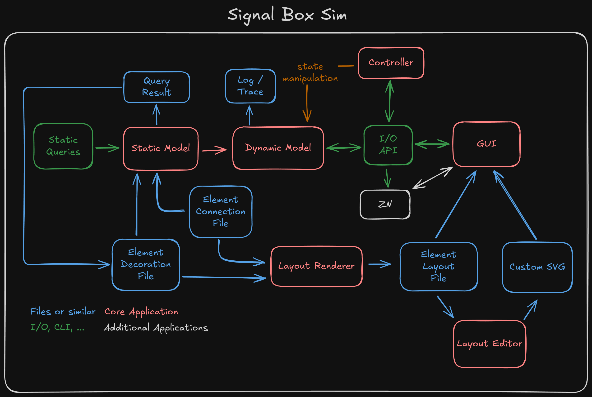

# Signal Box Sim

## Architecture

### Core Application
- [ ] Static Model
- [ ] Dynamic Model
- [ ] Controller
- [ ] Layout Renderer
- [ ] GUI
- [ ] Layout Editor

### Files Or Similar
- [ ] Element Connection File
- [ ] Element Decoration File
- [ ] Element Layout File
- [ ] Query Result
- [ ] Custom SVG
- [ ] Log / Trace

### I/O, CLI, ...
- [ ] Static Queries
- [ ] I/O API

### Additional Applications
- [ ] ZN